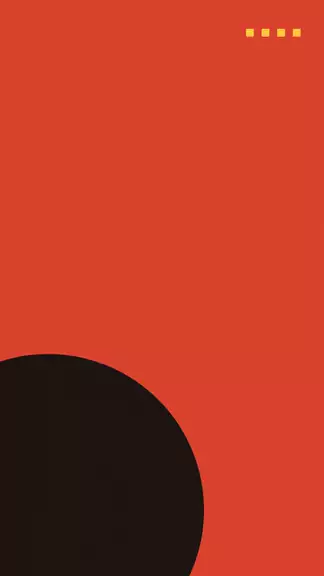
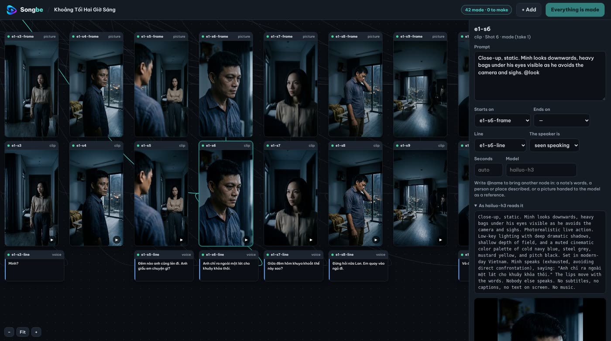
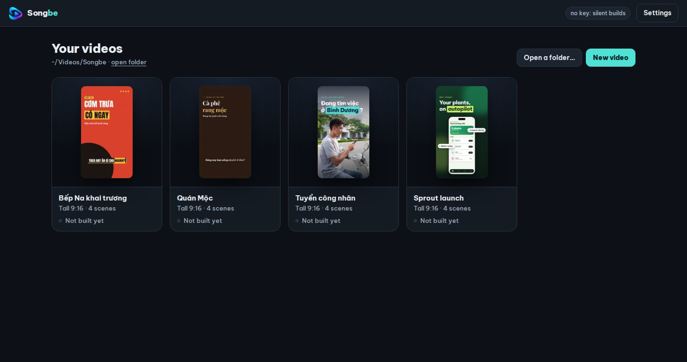
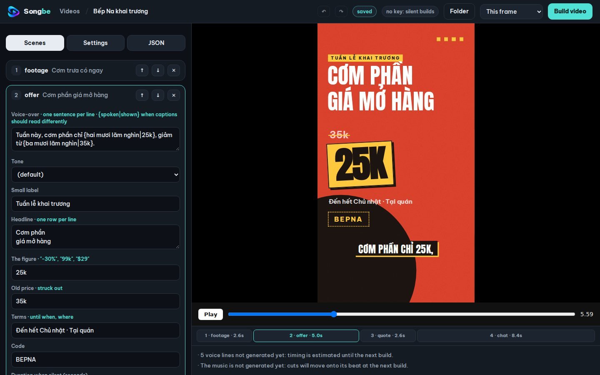
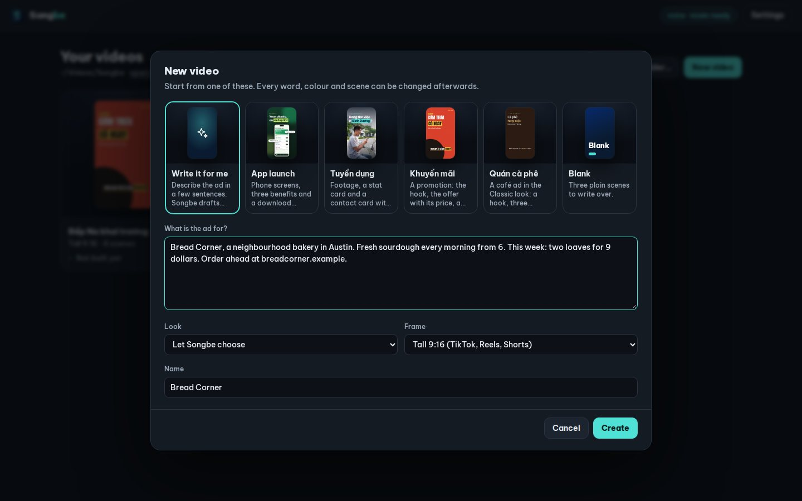

<p align="center"></p>
<h1 align="center">Songbe</h1>
<p align="center"><a href="https://github.com/Paparusi/songbe/actions/workflows/ci.yml"></a></p>

<p align="center">
  
  &nbsp;
  
</p>

**A description in, a finished short ad out.** Songbe turns a few sentences — or one `video.json` — into an MP4 with voice-over,
motion graphics, captions, music and sound effects, and then checks its own work before handing it over. It runs from the command
line with no interactive step, so an AI coding agent can drive it from start to finish; the same engine sits behind an app for
people who would rather click than type.

**An idea in, a series out.** `songbe film make my-series "<idea>"` writes the story and the shot table, gives every person a
face and a voice, draws every shot, records every line in its speaker's own voice, films the clips with the video models you
choose, and cuts the episodes. Everything it makes sits on one canvas (`flow.json`) where each picture, line and clip is a node
of its own: change a line, hand one shot to another model, add a prop of yours, and only what works from it is made again.
→ [Films and series](docs/film.md)

<p align="center"></p>

> Version 0.35.0. Nine scene types, three looks, packs for more, three frames from one spec, captions, cuts on the beat, a writer
> that drafts and corrects the script, built-in checks, an app with a visual editor. Tested on Linux, Windows and macOS (the tests
> and each installer run on all three for every release). Named after the Sông Bé, a river in southern Vietnam.

```
songbe build examples/app-launch-en       →  examples/app-launch-en/out/video.mp4  (+ sheet.jpg, check.json)
```

Three examples are included: `examples/app-launch-en` (an app launch, English, with phone screens), `examples/recruitment-vi`
(a recruitment ad, Vietnamese, with footage) and `examples/sale-vi` (a promotion, Vietnamese, no footage at all).

<p align="center"> </p>

## Why

- **One file in, one video out.** The spec is plain JSON you can diff, review and regenerate.
- **Deterministic picture.** Scenes are HTML/CSS; every frame is a pure function of time, rendered by headless Chrome with real motion blur (two samples per frame).
- **Sound follows picture.** Effects are synthesised from the cue list the animation itself reports, music ducks under the voice, the mix is normalised to −14 LUFS.
- **The timeline follows the voice, the cuts follow the music.** Each scene opens just before its line is spoken, and every cut is
  moved onto a beat of the music; change a sentence and everything re-times itself.
- **Bring your own keys — or none.** With `FAL_KEY` you get voice, music and generated footage. Without it the build still completes (no voice or music, plain backgrounds).
- **No npm dependencies.** Node 22+, ffmpeg and Chrome, Chromium or Edge. The browser is driven directly over the DevTools protocol.
- **It checks its own work.** Before drawing: nothing may leave the frame, overlap, or be covered by captions. After building: no black
  frames, no flashes, sound present and not clipping, the right length, a contact sheet, and — with `GROQ_API_KEY` — a transcript of
  what is actually audible.

## Quick start

Songbe needs Node 22 or newer, ffmpeg, and Chrome, Chromium or Edge. It has no npm dependencies, so there is nothing to install:

```bash
git clone https://github.com/Paparusi/songbe.git && cd songbe
node bin/songbe.mjs doctor                        # are ffmpeg, ffprobe and a browser found? which keys are set?
node bin/songbe.mjs app                           # the app: projects, visual editor, Build button (see below)
node bin/songbe.mjs frames examples/recruitment-vi # a few stills in out/frames — look before you render
node bin/songbe.mjs build  examples/recruitment-vi # full build
node bin/songbe.mjs preview examples/recruitment-vi # prints a file:// address: scrub and play in any browser
node bin/songbe.mjs write my-ad "What the ad is for, for whom, and what people should do"   # let Songbe draft video.json
node bin/songbe.mjs init my-ad                     # or start your own project from the example
node bin/songbe.mjs validate my-ad                 # every problem in video.json, with suggestions for typos
node bin/songbe.mjs schema                         # JSON Schema of video.json
```

Keys (`FAL_KEY`, optionally `GROQ_API_KEY`) are read from the environment, then from `<project>/.env` (git-ignored), then from the
keys saved in the app. Tool paths can be overridden with `SONGBE_FFMPEG`, `SONGBE_FFPROBE`, `SONGBE_CHROME`.

**ffmpeg.** macOS: `brew install ffmpeg`. Linux: your package manager. Windows has no package manager to point at, so
`songbe setup ffmpeg` (or the button in the app) fetches the build that ffmpeg.org links to, checks it against a checksum pinned
in `src/setup.mjs`, and keeps it in Songbe's own folder. Nothing is downloaded unless you ask.

## The spec

```jsonc
{
  "size": [1080, 1920], "fps": 30,
  "brand": { "name": "…", "ink": "#0A1B31", "primary": "#004DFC", "accent": "#4FE0D6", "paper": "#F2F6FC", "muted": "#51627A",
             "logo": { "mark": "media/mark.png", "word": "media/wordmark-white.png" } },
  "voice": { "voice": "Casual_Guy", "language": "Vietnamese", "speed": 1.08, "emotion": "happy" },   // or false
  "music": { "prompt": "warm optimistic pop instrumental…" },                                        // or { "file": "media/track.mp3" }
  "scenes": [ … ]
}
```

Every scene has a `type`, and usually a `say` (one sentence or a list of sentences) that sets how long it lasts.
In text fields `[[words]]` puts them on a highlight plate and `**words**` colours them with the accent.

| Type | What it shows | Fields |
| --- | --- | --- |
| `footage` | Full-bleed footage or image with a headline on top | `media`, `mediaOffset`, `label`, `labelStyle: "pill"`, `pin`, `title`, `sub`, `chip` |
| `card` | Light page: headline, a media card and a stat card | `label`, `title`, `media`, `caption`, `stat { badge, heading, sub }` |
| `list` | Headline and rows that arrive one by one | `tone`, `label`, `title`, `items[] { text, sub, icon }` |
| `phone` | Headline over a phone showing app screens, with callouts | `tone`, `label`, `title`, `screens`, `callouts[] { text, side, y }` |
| `chat` | Dark page: headline, a short chat, a contact card, brand footer | `label`, `title`, `messages[] { from, text }`, `contact { kicker, button, number[], sub }`, `footer { name, line }` |
| `offer` | A promotion: one big figure on a plate, the old price struck out, terms, a code | `tone`, `label`, `title`, `price`, `was`, `terms`, `code` |
| `photos` | Headline over one to four pictures in cards | `tone`, `label`, `title`, `photos[] { src, caption }` |
| `quote` | What a customer said: the words large, stars, who said it | `tone`, `label`, `quote`, `name`, `role`, `stars`, `photo` |
| `end` | Logo, name, tagline and a call to action | `tone`, `name`, `tagline`, `cta`, `badges[]`, `url` |

Every scene also accepts `say`, `duration` (when it has nothing to say) and `notice`.
The table above is a summary; `songbe schema` prints the exact shape and `songbe validate` checks a project against it.

`media` is a path to a video or image, or `{ "generate": { … } }` to have the footage made with your fal.ai key:

| Inside `generate` | What is made |
| --- | --- |
| `"image": "a description"` | a picture from the description |
| `"image"` and `"motion": "what moves"` | that picture, then a clip of about five seconds of it |
| `"from": "media/bottle.jpg"` and `"image": "what to make of it"` | a new picture made from yours: the same thing in another place, another light, at another angle |
| `"from": "media/bottle.jpg"` and `"motion"` | your picture as it is, cut to the frame and set in motion |

`from` is a png, jpg or webp of your own (a phone photo is turned upright first), or a list of them for models that take several.
Set `notice` (for example "Illustration generated with AI") on scenes that show generated people or places, or your product
somewhere it was not photographed.

<p align="center"><br>
<sub>The picture named in <code>from</code> (a stand-in made for this example) · with <code>"image": "the same bottle on a marble counter by a sunny window…"</code> · with only <code>"motion": "the camera pushes in slowly…"</code>, first and last frame</sub></p>

**Any model on fal.ai.** The picture, the clip, the music and the voice each have a default model, and none is fixed:
`"imageModel"` and `"videoModel"` inside `generate`, and `"model"` inside `music` and `voice`, take any endpoint in fal.ai's
catalogue (with another voice model, `voice.voice` is one of that model's voices; with `from`, the picture model is one that takes
pictures, `fal-ai/nano-banana/edit` unless you name another).

Songbe reads what each model takes from fal's own description of it and says what it has to say — the prompt, the picture to
start from, the frame's shape, the length, a clip's resolution, a seed — under that model's names and within its choices (a model
without a 9:16 option gets the nearest shape; one that only does six seconds gets six). The editor offers a short list of models
that were tried (`CATALOGUE` in `src/providers/fal.mjs`) and accepts any other id.

**A model's own settings.** Everything else a model takes is yours to set, by the model's own names: `imageOptions` and
`videoOptions` inside `generate`, `options` inside `music` and `voice`. `songbe model <endpoint>` lists them with their choices
and defaults (`--json` for an agent), and the editor shows them as a form under *Settings of this model*. A name the model does
not have stops the build before anything is paid for, with the list of those it has.

```json
"media": { "generate": { "from": "media/bottle.jpg", "image": "The same bottle on a marble counter by a sunny window",
                         "imageModel": "fal-ai/nano-banana-pro/edit", "imageOptions": { "resolution": "2K" },
                         "motion": "The camera pushes in slowly",
                         "videoModel": "fal-ai/kling-video/v2.5-turbo/pro/image-to-video" } }
```

## Writing it for you

```bash
node bin/songbe.mjs write my-ad "FitLoop, a gym in Austin open 24 hours. $29 a month, no contract. Book a free first visit at fitloop.example."
node bin/songbe.mjs write my-ad --brief=brief.txt --style=bold --format=square
```

A language model drafts `video.json` from the description, and Songbe checks the draft the way it checks any spec, then hands every
finding back for another pass (three at most):

- the shape, by the validator;
- how much text fits each place, from a table measured on the kit itself (see *How much fits*);
- the layout as actually drawn, when a browser is installed;
- **numbers and web addresses that are not in the description** — a draft may not show "24h", "4,000 customers" or a phone number
  that the brief never gave;
- colour pairs that could not be read (white on a pale brand colour), and a voice-over far from 15–25 seconds.

What is still open after the last pass is listed, not hidden, and a draft that is not valid is never saved. What no check can see
is a claim made in words ("the best in town"): read every line before publishing. The voice is set from Songbe's own table by
language; frame, look and captions are yours to choose (`--format`, `--style`, `--no-captions`). Pictures and clips already in
`<dir>/media` are offered to the writer; `--footage` lets it ask for generated footage, which costs more.

It runs on your own key: the `FAL_KEY` that already makes voice and music (through fal.ai's language-model endpoint, Claude
Sonnet 4.5 by default), or `ANTHROPIC_API_KEY` for Claude directly (`SONGBE_WRITER_MODEL` picks another model). A draft is two or
three requests of about five thousand tokens each. In the app it is the first choice under *New video*: **Write it for me**.

The fal.ai route is the one this release was tested on; the Anthropic route follows the published API but was not run against
the live service.

## How much fits

`kit/fit.json` records, for every text field of every scene type, the longest text that still looks as designed in all three
frames: the layout check finds nothing, the type is no more than a tenth smaller than with a few words, nothing wraps, is cut
off or touches the edge. It is measured, not guessed — `node tools/fit.mjs` draws about nine hundred trial scenes per look and
frame — and `node tools/fit.mjs --check` tells when the kit has drifted from it.

| | soft | bold |
| --- | --- | --- |
| Headline, per line (up to 3 lines) | 14 | 12 |
| Small label | 30 | 30 |
| List row / its second line (up to 4 rows) | 30 / 40 | 30 / 40 |
| Callout on the phone | 22 | 22 |
| Chat message (it may wrap to three lines) | 80 | 80 |
| Tagline / button on the end card | 40 / 26 | 40 / 26 |

`songbe validate` lists every text longer than its place. Longer text is still drawn — the kit shrinks type to fit — it just
rarely looks its best.

## Frames

One spec, several frames. `"format"` is `tall` (1080×1920, the default), `square` (1080×1080) or `wide` (1920×1080);
`"size": [w, h]` sets anything else. Scenes are laid out in design units, so `[540, 960]` and `[2160, 3840]` are the same picture
drawn smaller and larger, with type rendered sharp at that size.

```bash
node bin/songbe.mjs build my-ad --format=wide                 # out/video-wide.mp4, same voice and music
node bin/songbe.mjs build my-ad --formats=tall,square,wide    # all three, one after another
```

Every scene is designed once, for the tall frame, as a few blocks (heading, media, rows, phone…). For the other frames the blocks are
moved and scaled as wholes: in a wide frame the heading goes left and the rest right; in a square one the same stack is tightened.
Footage is cropped to cover the frame, leaning upward in a square; a portrait clip in a wide frame is not cropped but shown whole at
the side, over a blurred copy of itself. Voice, music and timing are identical across frames, so extra frames cost nothing to generate.

## Music and cuts

The beat of the music is found from the sound itself (onsets, the tempo at which they repeat, and the phase where the bass falls) —
no service, no metadata, about a tenth of a second per track. Each cut then moves to a beat: to one just before it when that is
within 0.15 s, otherwise to the next, pushing the following scenes back by that much. A sentence is never cut into, and a video gets
a few tenths of a second longer. Music shorter than the video repeats on a whole number of bars.

Music without a steady pulse is left alone and the report says so. `"music": { "sync": false }` or `--no-sync` keeps the voice's own timing.

## Captions

`"captions": true` (or `--captions` on the command line) adds one short line at the bottom that follows the voice, with the word being
spoken highlighted. Lines keep clauses together and are balanced rather than filled, so no word is left on its own.

Where the voice should say one thing and the caption show another, write both: `{spoken|shown}`.

```json
"say": "Looking for work in {Vee Sip two|VSIP 2}? Call {oh one two three, four five six|0123 456}."
```

Word times are estimated from the length of each word within its sentence — no speech recognition, no extra key. In square and wide
frames the scenes give up a band at the bottom so that captions do not sit on top of the content.

## Looks

`"style"` at the top of the spec picks the look; the brand colours stay yours.

| Style | What it looks like |
| --- | --- |
| `soft` (default) | Rounded cards, soft shadows and glows, lines that rise from behind a mask, a slanted colour sweep at each cut |
| `bold` | Condensed capitals (Anton), flat colour fields, square corners with ink outlines and hard shadows, headlines on ink blocks over footage, a flat band dropping through each cut |
| `classic` | Serif headlines (Playfair Display), hairline frames, flat paper and ink, a marker stroke for the highlight, the frame dipping through paper at each cut |

Try a look without touching the spec: `songbe frames my-ad --style=bold`, `songbe build my-ad --style=bold`.

A style is a style sheet of token overrides plus a few numbers (headline scale and leading, how lines arrive, how cuts are
covered). Scenes set geometry only, so a new look does not touch scene code — and does not have to live in Songbe at all:

## Packs

`classic` is not part of the kit. It comes from a **pack**: a folder with looks (a style sheet, its fonts, a few numbers) and
starters (ready projects to begin from), found in `packs/` here, in the data folder's `packs/` once installed, or wherever
`SONGBE_PACKS` points while one is being built.

```bash
node bin/songbe.mjs pack list                       # what is found, and every starter's id
node bin/songbe.mjs pack add ~/Downloads/night      # install a pack folder on this computer
node bin/songbe.mjs init my-ad --from=classic/quan-ca-phe
```

A pack runs no code, carries its own licence, and can be measured and checked with the same tools as the kit
(`node tools/fit.mjs --pack=<id>`). `docs/packs.md` describes the format; `packs/classic` is the worked example. Packs are how
more looks and industry-specific starters are added, or sold, without touching the core.

## How a build runs

1. **Plan** — one voice clip per sentence, silence trimmed; scenes are laid on a timeline that follows the speech; footage is cut into frames.
2. **Picture** — the scene page is written to `.songbe/index.html`; Chrome draws each frame and the screenshots are piped into ffmpeg.
3. **Sound** — voice on the timeline, music with sidechain ducking, synthesised effects on the animation's cues, loudness normalised.
4. **Check** — `out/sheet.jpg` and `out/check.json`. The command exits non-zero when a check finds a problem (see *Checks*).

Generated assets are cached in `.songbe/cache` by a hash of their inputs: editing one sentence regenerates one voice clip, nothing else.

## The app

```bash
node bin/songbe.mjs app                 # opens a window of its own when Chrome or Edge is installed; otherwise prints the address
node bin/songbe.mjs studio my-ad        # the editor for one project: http://127.0.0.1:4173
```

<p align="center"></p>

For people who would rather not edit JSON. The **home screen** lists your videos, each with a poster of its opening scene and
whether its video is up to date; *New video* writes one from your description, or starts from an example or from blank;
*Settings* holds your keys and shows what is installed. The **editor** has scenes and their fields on the left and the video on the right, updating as you type; click
any words in the video and the cursor lands in the field they come from, and every change can be undone and redone. The preview
is free — it reuses voice clips that already exist and estimates the timing of new sentences — and **Build video** runs the full
build and shows the result with its self-check. Images and clips are added to the project's `media/` folder from the form.
Footage can be a file, or made with AI: from a description, or starting from a picture of your own, with each model's own
settings a click away.
With a key, every scene also has **Rewrite this scene** (say what should change; the new scene is checked against the rest of the
video and can be undone) and, where footage is described rather than supplied, **Generate now**, which makes that picture or clip
at once instead of at the next build (`songbe footage <dir> --scene=N` does the same from the command line). On the home screen a
project can be renamed and copied.

Projects are ordinary folders (`video.json` plus `media/`) in your system's video folder, under `Songbe/`; a folder made by hand, by
the command line or by an agent joins the list with *Open a folder*. `songbe doctor` prints both that folder and the data folder,
where saved keys (`.env`, readable by you only), a fetched ffmpeg and the list of recent projects live.

The pages are served to this computer only, and the server treats every request as untrusted until shown otherwise: it listens on
127.0.0.1, answers only when the `Host` is that address (a name that merely resolves there is refused), refuses a foreign `Origin`,
requires a header that forms and image tags cannot set on anything that changes something, serves no file outside the project and
the kit, never serves an `.env`, and never sends a key back to the page.

### Installed

`app/` wraps the same engine in a native window (Tauri): an installer, an entry in the system's menu, no terminal. The window
shows exactly the pages above; the shell only starts the engine — Node, shipped next to it — and goes to the address the engine
prints.

**[Download the latest release](https://github.com/Paparusi/songbe/releases/latest)**: a setup program for Windows, a disk image
for macOS (Apple silicon), a `.deb` and an AppImage for Linux, with their checksums. Each was installed and started on a clean
machine before it was published. The `.deb` brings ffmpeg with it and puts `songbe` on the path, where it is the command line as
well as the app. The Windows installer is not code-signed, so Windows asks before running it; the macOS app is signed and checked
by Apple from the release whose notes say so (until then: *System Settings → Privacy & Security → Open Anyway*).

To build it yourself (Rust and `cargo install tauri-cli`; see `app/README.md`):

```bash
node app/build.mjs          # the installer for this system (the paths are printed at the end)
node app/smoke.mjs          # start what was built and check that it works
```

From a checkout on Linux, `songbe app --add-launcher` puts the app in the applications menu without building anything.

## Checks

```bash
node bin/songbe.mjs lint my-ad      # layout only, a few seconds: what leaves the frame, overlaps, or would be covered
npm test                            # the test suite (about half a minute; drawing tests need a browser and ffmpeg)
```

**Layout check** (`songbe lint`, and automatically with `frames` and `build`). Each scene is drawn near its end and its content is
measured, down to the words themselves. *Problems*: something runs off the frame, two things overlap, a text is cut off by the box
it sits in or runs into another text, captions would cover something. *Notes*: text that had to be shrunk a lot to fit, words lying
against the edge of the frame, content in the bottom 330 px of a tall frame (phone apps cover it), a phone with no screenshot to show. Scenes do most of the fitting themselves —
they squeeze toward the floor of the usable area and make room for the caption band — so a problem here usually means too many words.

**After a build** the whole picture is watched once for black frames, for flashes (the picture jumps and comes straight back), for
long stretches where nothing moves, and the sound is measured. Findings go to `out/check.json` as `problems` (the command exits
non-zero) and `notes`.

Frames are drawn without cached layers, so a frame is the same pixels whatever was drawn before it; scaled cards stay sharp.

## Using it from an AI agent

`AGENTS.md` describes the loop for any coding agent. For Claude Code there is a ready-made skill: copy `skill/` to
`~/.claude/skills/songbe/` and ask for a video; the agent writes the spec, checks stills, builds and reads the report.

## Limits today

- Nine scene types; three looks (two in the kit, one bundled as a pack). Scene types live in `kit/scenes.js` and cannot come from packs.
- One provider (fal.ai), though any of its picture, clip, music and voice models can be used. The writer also takes an Anthropic key.
- Frames between the three named shapes (4:5, 21:9…) use the nearest layout family and have not been tuned.
- The editor edits fields and reorders scenes; there is no free-form canvas or keyframe timeline.
- The Windows installer is not code-signed. The macOS app is for Apple silicon only. *Open a folder* takes a typed path rather
  than a system dialog.

## More to read

- `docs/packs.md` — making a pack: looks and starters outside the core.
- `docs/film.md` — films and series: the files, the canvas, the models.
- `DEVELOPING.md` (how the code is laid out and what a change needs), `SECURITY.md`, `CHANGELOG.md`.
- `app/README.md` — the desktop shell, how installers are built and what has been checked on which system. `.github/workflows/`
  runs the tests on every push, and builds, installs and starts the installers of a tagged release before attaching them.

## Licence

A copy runs as a trial for 14 days; after that a licence key keeps it making things (*Settings → Licence*, or
`songbe licence <key>`). Without one, everything you made still opens and exports.

Songbe is proprietary software. Copyright © 2026 Le Hieu, all rights reserved: using it needs a licence from its owner, and it may
not be copied, passed on or changed without one (`LICENSE`). What you make with it is yours. Versions 0.19.1 and earlier were
published under Apache-2.0, which still applies to those versions only.

It is distributed with the work of others under their own licences: the fonts Be Vietnam Pro, Anton and Playfair Display (all SIL
OFL 1.1), and in the installed app Node.js next to the engine and the Rust crates of the window. ffmpeg is never part of a Songbe
package. See `NOTICE`.
